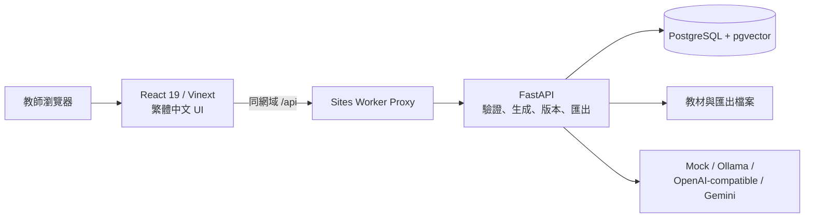

# LessonForge TW

**給台灣補習班與英文教師的 AI 教材生產工作台。** 以自己的教材、班級程度與教學目標為基礎，產生可編輯、可送審、可追蹤版本，並能匯出 PDF／DOCX 的完整課程包。

[](https://github.com/Lucas66666677/LessonForge-TW/actions/workflows/ci.yml)
[](https://github.com/Lucas66666677/LessonForge-TW/actions/workflows/e2e.yml)
[](https://lessonforge-tw-lucas.lucas66666677.chatgpt.site)
[](#產品特色)

> [!TIP]
> **[開啟線上產品預覽](https://lessonforge-tw-lucas.lucas66666677.chatgpt.site)**<br>
> 為保護資料與管理功能，線上環境不提供公開共用的管理帳密。

線上環境使用不計費的 Mock AI Provider，因此不需要 API key，也不會把 Demo 教材送到外部模型。免費 API 閒置後會休眠，第一次開啟可能需要約 50 秒喚醒。

## 為什麼做 LessonForge TW

一般 AI 對話工具可以產生一份講義，但補習班真正需要的是一條可控的教材工作流：知道教材來源、帶入班級脈絡、保留老師修改、區分學生版與教師版、留下版本與核准紀錄，最後穩定匯出。

LessonForge TW 把這些步驟放在同一個繁體中文工作台中，讓 AI 負責加速初稿，老師保有最後決定權。

## 產品工作流

1. 建立班級、匿名學生代號、程度、弱點與教學偏好。
2. 上傳自有 PDF、DOCX、TXT 或 Markdown 教材。
3. 選擇課程範圍、時數、目標、作業與週考需求。
4. 產生課程規劃、講義區塊、題目、答案解析與家長報告。
5. 編輯、排序、複製、鎖定或局部重新生成內容。
6. 送審、核准、保留不可變版本，匯出學生版與教師版 PDF／DOCX。

## 產品特色

- **繁體中文教學工作台**：登入、班級、學生、教材、生成精靈、編輯器、預覽、匯出、成員與設定均已完成。
- **教師可控的 AI 流程**：支援區塊鎖定、局部重生、schema repair、內容驗證、失敗原因與重試。
- **多種模型路徑**：內建 deterministic Mock，並支援 Ollama、OpenAI-compatible 與 Gemini Provider。
- **完整教材輸出**：學生講義、教師版、作業、週考與家長報告，可輸出 PDF／DOCX。
- **學生版答案隔離**：學生輸出不包含答案、解析或教師備註；教師輸出保留完整資訊。
- **多租戶與角色權限**：Owner／Admin／Teacher、JWT／Argon2、顯式 `organization_id` 範圍與 audit log。
- **安全教材處理**：檢查副檔名、MIME、檔案 signature、大小、SHA-256 與安全檔名；掃描 PDF 會明確要求 OCR。
- **可驗證的品質**：Vitest、pytest、Playwright、axe、24 組 synthetic eval 與 GitHub Actions。

## 系統架構



| 層級       | 技術                                                               |
| ---------- | ------------------------------------------------------------------ |
| Web        | React 19、TypeScript strict、Vinext/Vite、TanStack Query、Radix UI |
| API        | FastAPI、Pydantic 2、SQLAlchemy 2 async、Alembic、JWT、Argon2      |
| 正式資料層 | PostgreSQL 17、pgvector、Redis、背景 worker                        |
| 本機 Demo  | SQLite、檔案儲存、in-process jobs、Mock Provider                   |
| 文件輸出   | Jinja2、Playwright PDF、python-docx DOCX                           |

深入說明請看 [架構文件](docs/ARCHITECTURE.md) 與 [API 文件](docs/API.md)。

## 線上 Demo 架構

- 前端：OpenAI Sites，使用同網域 API proxy。
- API：Render Free Web Service。
- 資料庫：Render Free PostgreSQL + pgvector。
- AI：Mock Provider，不會產生模型費用。
- 目前用途：功能展示與作品集 Demo，不是正式商用環境。

免費環境的 API 會在閒置後休眠；PostgreSQL 有容量、期限與備份限制，檔案系統也不是持久儲存。部署細節與升級路徑請看 [正式部署文件](docs/PRODUCTION.md)。

## 本機快速啟動（Windows、無 Docker）

需求：Node.js 22.13+、npm 10+、Python 3.11+、Git。

```powershell
python -m venv .venv
.\.venv\Scripts\python.exe -m pip install --upgrade pip setuptools==83.0.0
.\.venv\Scripts\python.exe -m pip install -e ".[dev]"
npm ci
.\.venv\Scripts\python.exe -m playwright install chromium
Copy-Item .env.example .env
# 在 .env 內為 DEMO_OWNER_PASSWORD 與 DEMO_TEACHER_PASSWORD 設定各自的本機密碼。
.\.venv\Scripts\python.exe -m alembic -c services/api/alembic.ini upgrade head
.\.venv\Scripts\python.exe scripts/seed.py
```

開啟兩個 PowerShell 視窗。

API：

```powershell
.\.venv\Scripts\python.exe -m uvicorn lessonforge.main:app --host 127.0.0.1 --port 8000
```

Web：

```powershell
$env:VITE_API_BASE_URL="http://127.0.0.1:8000"
npm run dev
```

前往 [http://localhost:3000/login](http://localhost:3000/login)。完整操作順序請看 [Demo 腳本](docs/DEMO_SCRIPT.md)。

## Docker Compose

```bash
cp .env.example .env
docker compose up --build
docker compose exec api python scripts/seed.py
```

Compose 會啟動 Web、API、worker、PostgreSQL/pgvector 與 Redis。結束時執行：

```bash
docker compose down
```

## 切換本機 Ollama

```powershell
ollama pull qwen3:8b
ollama pull nomic-embed-text
ollama serve
```

在 `.env` 設定：

```dotenv
LLM_PROVIDER=ollama
LLM_MODEL=qwen3:8b
LLM_BASE_URL=http://localhost:11434
EMBEDDING_PROVIDER=ollama
EMBEDDING_MODEL=nomic-embed-text
```

模型輸出仍會經過 schema、時間配置、題目、答案、引用與鎖定區塊驗證，最後必須由教師核准。

## 驗證

```powershell
npm run lint
npm run typecheck
npm run test:unit
npm run build
.\.venv\Scripts\python.exe -m ruff check services scripts evals
.\.venv\Scripts\python.exe -m mypy services/api/lessonforge
.\.venv\Scripts\python.exe -m pytest
.\.venv\Scripts\python.exe evals/run_eval.py
npm run e2e
```

最新實測結果：17 個 Python tests、6 個前端 unit tests、24 組 eval cases 與 Chromium E2E 均通過。完整紀錄請看 [測試報告](docs/TEST_REPORT.md) 與 [專案狀態](STATUS.md)。

## Repository 導覽

```text
app/                    React 產品 UI
services/api/           FastAPI、資料模型、生成、檢索、匯出與測試
services/worker/        背景 worker entrypoint
prompts/                版本化 prompt templates
templates/              PDF／DOCX 樣式與模板
fixtures/               合法自製 Demo 教材
evals/                  synthetic eval cases 與 runner
e2e/                    Playwright 核心流程與無障礙驗收
scripts/                bootstrap、seed、demo-check 與輔助工具
infra/                  容器與部署設定
docs/                   架構、API、部署、排錯、Demo 與測試報告
```

## 文件

- [Demo 操作腳本](docs/DEMO_SCRIPT.md)
- [系統架構](docs/ARCHITECTURE.md)
- [API 摘要](docs/API.md)
- [正式部署](docs/PRODUCTION.md)
- [測試報告](docs/TEST_REPORT.md)
- [故障排除](docs/TROUBLESHOOTING.md)
- [安全政策](SECURITY.md)

## 正式使用前

正式環境需要獨立秘密管理、TLS/WAF、持久化物件儲存、備份還原、監控告警、惡意檔案掃描、分散式 rate limit，以及教材授權與學生資料治理政策。請勿直接把免費 Demo 環境用於真實學生資料或正式營運。

---

如果你正在為台灣補習班建立可控、可審核的 AI 教材流程，歡迎開 Issue 分享使用情境與建議。
