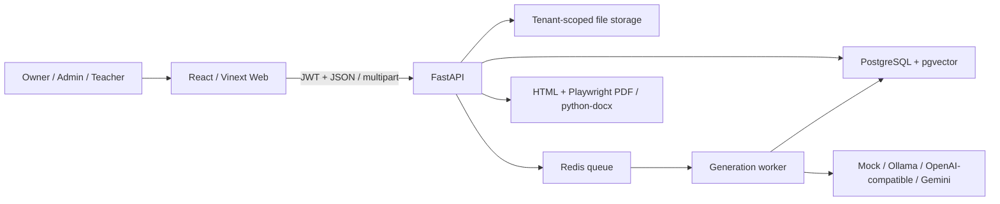
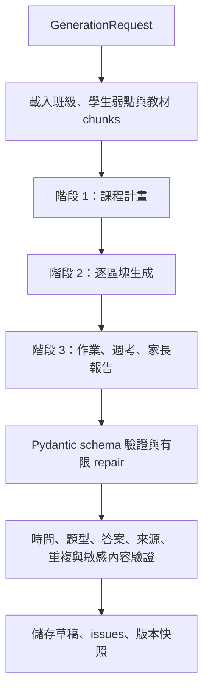

# 架構

## 系統邊界

LessonForge TW 是模組化 monorepo。瀏覽器只與 FastAPI 溝通；API 負責身分、tenant scope、檔案安全、檢索、教材狀態與匯出；生成工作可在本機 in-process 執行，正式環境則由 Redis queue 與獨立 worker 消費。

本機無 Docker 路徑把 DB 換成 SQLite、queue 換成 in-process task；domain schema、驗證器與 export code 不變。

## 資料與 tenant 邊界

核心資料表包含 `organizations`、`users`、`memberships`、`class_groups`、`student_profiles`、`source_materials`、`material_chunks`、`lesson_templates`、`generation_runs`、`lesson_packages`、`lesson_blocks`、`questions`、`validation_issues`、`lesson_package_versions` 與 `audit_logs`。

每筆組織資料都帶 `organization_id`。Repository/service 查詢在 SQL `WHERE` 階段同時比對資源 ID 與目前 membership 的 organization ID；跨 tenant UUID 不回傳 403 暗示存在，而是回傳 404。上傳檔案使用 `organization_id/uuid.ext`，顯示名稱不作為實體路徑。

## 教材攝取與檢索

1. API 先限制大小與支援格式，再交叉檢查副檔名、宣告 MIME 與檔案 signature。
2. 檔案以 UUID 儲存並計算 SHA-256；解析 PDF、DOCX、TXT 或 Markdown。
3. PDF 若幾乎沒有可抽取文字，狀態改為失敗並回報需要 OCR，不會假裝成功。
4. 解析內容依頁／段落切塊，保存章節、主題、難度、標籤與原始定位。
5. PostgreSQL 可使用全文與向量候選；缺少向量能力、Ollama 或 pgvector 時，以 organization-filtered 文字評分退化執行。
6. 來源引用只允許本次選取教材 ID，validation issue 會攔截越界引用。

## 生成 pipeline

Provider 只負責結構化生成；資料載入、prompt 組合、schema、repair、鎖定保護與驗證均留在 application layer。Mock Provider 使用固定規則產出可重現資料，供 Demo、CI 與 eval 使用。

## 編輯、版本與核准

教材是 typed blocks，而不是通用 HTML。每個 mutation 重新驗證完整 package、建立 immutable version snapshot 並寫 audit log。鎖定區塊不可局部重生；全包重生／版本還原也必須通過 locked-block exact comparison。存在 `fatal` issue 時核准 API 回傳衝突，教師必須先修正。

狀態主要為 `draft` → `review` → `approved`；Owner/Admin 可核准，Teacher 可編輯並送審。前端角色差異只是 UX，真正授權在 API dependency 與 tenant query。

## 匯出界線

同一 `PackageView` 經用途 policy 轉成：

- `student`：題目與學生內容，不含答案、解析、教師備註。
- `teacher`：包含答案、解析、備註與來源定位。
- `homework`：依天分段的作業與作答區。
- `quiz`：週考與獨立答案頁。
- `parent`：完成度、表現、進步、弱點、下週重點與教師備註。

HTML 由 Jinja2 autoescape，PDF 由 headless Chromium，DOCX 由 python-docx。匯出 API 仍做 tenant scope 與核准狀態檢查。

## 可觀測性與失敗處理

`generation_runs` 保存 provider、model、prompt version、進度、attempt、failure reason 與 timestamps。教材或 AI raw content 預設不寫 log；audit log 只記 action、actor、resource 與低敏感 metadata。正式環境應把結構化 log、metrics 與 trace 接到既有觀測平台，並對 queue backlog、連續生成失敗、匯出失敗及磁碟容量告警。

## 已知取捨

- SQLite fallback 讓 Demo 不依賴 Docker，但不代表正式多程序一致性。
- 本機 rate limiter 是單程序記憶體實作；正式環境需移至 ingress 或 Redis。
- 檔案系統儲存適合單機 Demo；多實例應改 object storage。
- Vinext 仍為 beta；已鎖定版本並有 build/E2E 回歸，升級必須重新跑完整套件。
- OCR、惡意程式掃描、SSO、密碼重設與寄信不在本次可運作核心範圍，正式上線前應由平台服務補齊。
